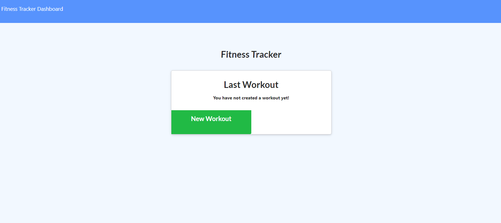

# Work Day Scheduler

## Description

This application is intended to organize a person's fitness routine with simple to use features within the browser.

## Table of Contents

* [Features](#Features)
* [Links](#Links)
* [Screenshots](#Screenshots)
* [Language](#Language)

## Features

- [x] Allows user to make new workout logs.
- [x] Allows user to log their past workouts.

## Links

* Project Repo: [Repository](https://github.com/Darrellfr3/FItness-Tracker)
* GitHub Page: [Website](https://cryptic-cliffs-15422.herokuapp.com/)

## Screenshots

## Language

* JavaScript
* HTML
* CSS
* [Express](https://expressjs.com/)
* [Morgan](https://www.mongodb.com/)
* [Mongo](https://jquery.com/)
* [jQuery](https://jquery.com/)
* [Bootstrap](https://getbootstrap.com/)
